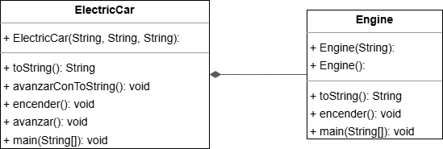

# Tema 01 | Composición - Exercise02_Composition

<h1 align="center">
  
</h1>

<div align="center">
  <strong>🎓 Parte del curso de Ingeniería del Software en U-tad</strong><br>
   🚀 Implementación de una clase `ElectricCar` mediante composición.
</div>

---

## 📄 Enunciado del Ejercicio

El objetivo del ejercicio es implementar una clase llamada `ElectricCar` que represente un coche eléctrico, utilizando el concepto de composición con la clase `Engine` desarrollada previamente:

1. Crear una clase `ElectricCar` con los atributos `marca`, `modelo` y `color` (todos de tipo String).
2. Establecer una relación de composición con la clase `Engine` del ejercicio anterior ("tiene un motor").
3. Implementar un constructor con tres parámetros: marca, modelo y color.
4. Añadir dos métodos de comportamiento: `encender()` (que delegará en el motor) y `avanzar()` (que imprimirá un mensaje).
5. Sobrescribir el método `toString()` para mostrar la información del coche y utilizarlo en el método `avanzar()`.
6. Probar la clase `ElectricCar` en el método `main`, creando un coche Tesla Model3 de color rojo.
7. Comparar la solución de composición en la que el objeto se crea en la declaración del atributo engine.

---

## 📂 Estructura de la Carpeta

> [!TIP]
> **Organización del Proyecto:**  
> Mantener una estructura clara facilita el mantenimiento y la extensibilidad del código. Revisa la siguiente organización para entender la distribución de los archivos.

### 📁 Estructura de la carpeta `Exercise02_Composition`:
```
 📁 Tema01_Composition
  ├── 📄 ElectricCar.java         // Clase principal que implementa el coche eléctrico
  ├── 📄 UML.png                  // Diagrama UML que muestra la relación de composición
  └── 📄 README.md                // Documento explicativo del ejercicio y solución
```

---

## 🌟 Diagrama UML de la Solución

<p align="center">
  <a href="UML.png">
    
  </a>
</p>
<p align="center"><i>Diagrama UML generado por Intellij.</i></p>

---

## 📜 Descripción de la Solución

La solución se estructura en varias partes que cumplen con los puntos solicitados:

### 1. **Clase `ElectricCar` con Atributos (2.a)**

Los atributos `marca`, `modelo` y `color` representan las características del coche eléctrico. Además, se establece una relación de composición con la clase `Engine` mediante el atributo `engine`:

```java
// Atributos de la clase ElectricCar
private String marca;   // Atributo marca
private String modelo;  // Atributo modelo
private String color;   // Atributo color

// Relación de composición: ElectricCar tiene un motor (Engine)
private Engine engine; // Atributo que representa el motor (composición)
```

### 2. **Constructor para Inicializar los Atributos (2.a)**

El constructor inicializa los atributos del coche eléctrico y crea la instancia del motor eléctrico:

```java
// Constructor con parámetros para inicializar los atributos
public ElectricCar(String marca, String modelo, String color) {
    super(); // Llama al constructor de la clase padre (Object)
    this.marca = marca;   // Inicializa el atributo marca
    this.modelo = modelo; // Inicializa el atributo modelo
    this.color = color;   // Inicializa el atributo color
    this.engine = new Engine("eléctrico"); // Crea un motor eléctrico para el coche
}
```

### 3. **Métodos de Comportamiento: `encender()` y `avanzar()` (2.b)**

El método `encender()` delega el comportamiento en el motor, mientras que `avanzar()` imprime un mensaje con los datos del coche:

```java
// Método para encender el motor, delegando el comportamiento al motor
public void encender() {
    this.engine.encender(); // Delegación por composición
}

// Método para avanzar, muestra un mensaje con los datos del coche
public void avanzar() {
    System.out.println(this.marca + "," + this.modelo + "," + this.color + " avanzando...");
}
```

### 4. **Sobrescritura del Método `toString()` (2.c)**

El método `toString()` se redefine para mostrar la información completa del coche eléctrico, incluyendo su motor:

```java
@Override
public String toString() {
    return "ElectricCar [marca=" + this.marca + ", modelo=" + this.modelo +
            ", color=" + this.color + ", engine=" + this.engine + "]";
}

// Método avanzar usando la representación toString() del objeto
public void avanzarConToString() {
    System.out.println(this.toString() + " avanzando...");
}
```

### 5. **Método `main` para Probar la Clase (2.d)**

En el método `main`, se crea una instancia de un coche Tesla Model3 de color rojo y se prueban los métodos implementados:

```java
public static void main(String[] args) {
    // Crear un objeto ElectricCar con marca Tesla, modelo Model3, y color rojo
    ElectricCar electricCar = new ElectricCar("Tesla", "Model3", "rojo");

    // Llamar a los métodos para encender y avanzar
    electricCar.encender();      // Llama al método encender del motor eléctrico
    electricCar.avanzar();       // Muestra el mensaje de avance con los detalles del coche
    electricCar.avanzarConToString(); // Muestra el mensaje de avance usando toString()
}
```

### 6. **Comparación de Soluciones de Composición (2.e)**

En esta implementación, el objeto `Engine` se crea directamente en el constructor de `ElectricCar`. Una alternativa sería crear el objeto en la propia declaración del atributo:

```java
// Solución 1: Creación en el constructor (implementada)
private Engine engine;
// ...en el constructor:
this.engine = new Engine("eléctrico");

// Solución 2: Creación en la declaración (alternativa)
private Engine engine = new Engine("eléctrico");
```

La ventaja de la primera solución es que permite mayor flexibilidad, ya que el tipo de motor puede determinarse en tiempo de ejecución según los parámetros del constructor. La segunda solución fija el tipo de motor en tiempo de compilación.

---

## 💡 Notas Adicionales

Esta solución demuestra el concepto de composición en la programación orientada a objetos, donde un objeto contiene y administra otro objeto como parte de su funcionamiento interno.

- La delegación a través de la composición permite reutilizar la funcionalidad de la clase `Engine` sin heredar de ella.
- La creación del motor en el constructor permite inicializar el tipo de motor de manera flexible.
- El uso del método `toString()` en el método `avanzarConToString()` muestra cómo reutilizar código existente.

---

## 📬 Contacto

<p align="center"> Si tienes preguntas o deseas colaborar en proyectos similares, ¡no dudes en contactarme! </p>

<p align="center">
  <a href="https://www.linkedin.com/in/manuel-mart%C3%ADnez-ram%C3%B3n-415711265/"></a>
  <a href="mailto:manu08martinez@gmail.com"></a>
</p>