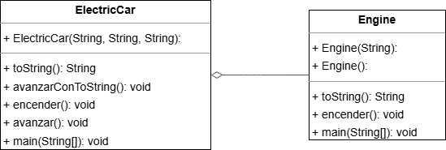

# Tema 01 | Agregación - Exercise03_Aggregation

<h1 align="center">
  
</h1>

<div align="center">
  <strong>🎓 Parte del curso de Ingeniería del Software en U-tad</strong><br>
  🚀 Implementación de una clase `Car` mediante agregación.
</div>

---

## 📄 Enunciado del Ejercicio

El objetivo del ejercicio es implementar una clase llamada `Car` utilizando el concepto de agregación con la clase `Engine` desarrollada previamente:

1. Crear una versión alternativa de la clase `ElectricCar`, denominada `Car`, que muestre una relación del tipo "tiene un motor" pero mediante una composición débil o agregación.
2. Comparar los diagramas UML de esta versión con los del ejercicio de composición (Exercise02_Composition).
3. En el método `main` de la clase `Car`, crear un objeto `electricEngine` que será utilizado como parámetro en la creación del objeto `Car` de marca Tesla, modelo Model3 y color rojo.
4. Invocar los métodos `encender` y `avanzar` sobre el objeto instanciado.

---

## 📂 Estructura de la Carpeta

> [!TIP]
> **Organización del Proyecto:**  
> Mantener una estructura clara facilita el mantenimiento y la extensibilidad del código. Revisa la siguiente organización para entender la distribución de los archivos.

### 📁 Estructura de la carpeta `Exercise03_Aggregation`:
```
📁 Tema03_Aggregation
├── 📄 Car.java                // Clase principal que implementa el coche con agregación
├── 📄 UML.png                 // Diagrama UML que muestra la relación de agregación
└── 📄 README.md               // Documento explicativo del ejercicio y solución
```

---

## 🌟 Diagrama UML de la Solución

<p align="center">
  <a href="UML.png">
    
  </a>
</p>
<p align="center"><i>Diagrama UML generado por Intellij.</i></p>

---

## 🔄 Comparación de Diagramas UML: Composición vs Agregación

En el diagrama UML:

- **Composición (Exercise02_Composition)**: ElectricCar ◆───────> Engine
    - El rombo negro (◆) indica una relación fuerte donde el motor es parte integral del coche eléctrico.
    - El objeto Engine es creado y destruido junto con el objeto ElectricCar.  
      [Ver ejercicio](https://github.com/ch0rtas/IS-Diseno_de_Software/tree/main/DisenoSoftware/src/Tema01/Exercise02_Composition)


- **Agregación (Exercise03_Aggregation)**: Car ◇───────> Engine
    - El rombo blanco (◇) indica una relación débil donde el motor es utilizado por el coche pero puede existir independientemente.
    - El objeto Engine puede existir antes de la creación del objeto Car y puede seguir existiendo después de su destrucción.

---

## 📜 Descripción de la Solución

La solución se estructura en varias partes que cumplen con los puntos solicitados:

### 1. **Clase `Car` con Atributos y Relación de Agregación (3.a)**

Los atributos `marca`, `modelo` y `color` representan las características del coche. Se establece una relación de agregación con la clase `Engine` mediante el atributo `engine`:

```java
// a. Atributos de la clase Car
private String marca;  // Atributo para la marca del coche
private String modelo; // Atributo para el modelo del coche
private String color;  // Atributo para el color del coche
private Engine engine; // Relación de agregación con la clase Engine (un coche tiene un motor)
```

### 2. **Constructor con Parámetro `Engine` (3.a)**

El constructor recibe un objeto `Engine` como parámetro, lo que permite la agregación:

```java
// b. Constructor de la clase Car que acepta marca, modelo, color y un objeto Engine
public Car(String marca, String modelo, String color, Engine engine) {
    super(); // Llama al constructor de la clase padre (Object)
    this.marca = marca;  // Inicializa el atributo marca
    this.modelo = modelo; // Inicializa el atributo modelo
    this.color = color;  // Inicializa el atributo color
    this.engine = engine; // Asocia el motor al coche (agregación)
}
```

### 3. **Métodos de Comportamiento: `encender()` y `avanzar()` (3.a)**

Al igual que en la versión con composición, el método `encender()` delega en el motor, mientras que `avanzar()` imprime un mensaje con los datos del coche:

```java
// a. Método para encender el motor del coche (delegación del comportamiento al objeto Engine)
public void encender() {
    this.engine.encender(); // Llama al método encender del motor
}

// b. Método para hacer avanzar el coche, mostrando los detalles del coche
public void avanzar() {
    System.out.println(this.marca + "," + this.modelo + "," + this.color + " avanzando...");
}
```

### 4. **Método `main` para Probar la Clase (3.b)**

En el método `main`, se crea primero un objeto `Engine` que luego se pasa como parámetro al constructor de `Car`:

```java
public static void main(String[] args) {
    // b. Crear un objeto Engine con el tipo 'eléctrico'
    Engine electricEngine = new Engine("eléctrico");
    
    // b. Crear un coche (Car) de marca Tesla, modelo Model3 y color rojo, utilizando el motor eléctrico
    Car electricCar = new Car("Tesla", "Model3", "rojo", electricEngine);
    
    // b. Llamar al método encender del coche (delegación al motor eléctrico)
    electricCar.encender(); // Enciende el motor eléctrico
    
    // b. Llamar al método avanzar del coche
    electricCar.avanzar();  // Muestra el mensaje de que el coche está avanzando
}
```

---

## 💡 Diferencias entre Composición y Agregación

### Composición (Exercise02_Composition)

```java
// En ElectricCar.java
private Engine engine;

// En el constructor:
this.engine = new Engine("eléctrico"); // La instancia de Engine es creada dentro de ElectricCar
```

### Agregación (Exercise03_Aggregation)

```java
// En Car.java
private Engine engine;

// En el constructor:
public Car(String marca, String modelo, String color, Engine engine) {
    this.engine = engine; // La instancia de Engine es recibida como parámetro
}

// En el método main:
Engine electricEngine = new Engine("eléctrico"); // La instancia es creada fuera de Car
Car electricCar = new Car("Tesla", "Model3", "rojo", electricEngine);
```

**Principales diferencias:**

1. **Ciclo de vida**:
    - En la composición, el motor no existe sin el coche (dependencia fuerte).
    - En la agregación, el motor puede existir independientemente del coche (dependencia débil).

2. **Propiedad**:
    - En la composición, ElectricCar es el único propietario del motor.
    - En la agregación, el motor puede ser compartido entre diferentes instancias de Car.

3. **Implementación**:
    - En la composición, el motor se crea dentro del constructor de ElectricCar.
    - En la agregación, el motor se crea externamente y se pasa como parámetro al constructor de Car.

---

## 💻 Ejemplo de Ejecución

```
eléctrico encendido!
Tesla,Model3,rojo avanzando...
```

---

## 💡 Notas Adicionales

Esta solución demuestra el concepto de agregación en la programación orientada a objetos, donde un objeto utiliza otro objeto que puede existir independientemente.

- La agregación permite mayor flexibilidad que la composición, ya que el mismo motor podría ser utilizado por diferentes coches.
- Este enfoque facilita la reutilización de objetos y permite una mayor modularidad en el diseño.
- La delegación de comportamiento funciona de manera similar tanto en la composición como en la agregación.

---

## 📬 Contacto

<p align="center"> Si tienes preguntas o deseas colaborar en proyectos similares, ¡no dudes en contactarme! </p>

<p align="center">
  <a href="https://www.linkedin.com/in/manuel-mart%C3%ADnez-ram%C3%B3n-415711265/">
    
  </a>
  <a href="mailto:manu08martinez@gmail.com">
    
  </a>
</p>