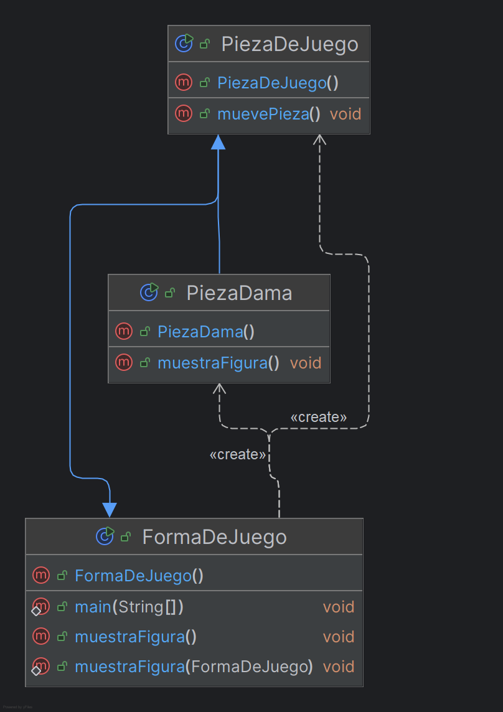

# Tema 01 | Polimorfismo - Exercise05_Polimorfismo

<h1 align="center">
  
</h1>

<div align="center">
  <strong>🎓 Parte del curso de Ingeniería del Software en U-tad</strong><br>
  🚀 Implementación del concepto de polimorfismo en un juego de tablero.
</div>

---

## 📄 Enunciado del Ejercicio: Polimorfismo

El objetivo de este ejercicio es implementar y analizar diferentes clases que ejemplifiquen el concepto de polimorfismo en la programación orientada a objetos. A continuación, se detallan las tareas a realizar:

### 1. Clase Base: `FormaDeJuego`
- Implementa una clase denominada `FormaDeJuego`.
- Define un método público `muestraFigura()` cuya implementación imprima en consola: `"Mostrando forma"`.
- Representa esta clase en un diagrama UML.

### 2. Subclase: `PiezaDeJuego`
- Crea una clase llamada `PiezaDeJuego` que extienda `FormaDeJuego`.
- Añade un nuevo método público `muevePieza()` que imprima en consola: `"Moviendo pieza de juego"`.
- Representa esta clase en un diagrama UML.

### 3. Instanciación Polimórfica
- En el método `main` de la clase `FormaDeJuego`, crea un objeto llamado `figura` de tipo `FormaDeJuego` que sea una instancia de `PiezaDeJuego`.
- Responde: ¿Qué métodos pueden invocarse sobre el objeto `figura`? Justifica tu respuesta.

### 4. Subclase Especializada: `PiezaDama`
- Crea una subclase llamada `PiezaDama` que extienda `PiezaDeJuego`.
- Sobrescribe el método `muestraFigura()` para que imprima en consola: `"Mostrando Dama"`.
- Representa esta clase en un diagrama UML.

### 5. Método Estático
- Añade un método estático a la clase `FormaDeJuego` llamado `muestraFigura(FormaDeJuego forma)`, que reciba un parámetro de tipo `FormaDeJuego`.
- Dentro del cuerpo del método, invoca el método `muestraFigura()` del objeto recibido como parámetro.
- Responde: ¿Qué mensajes aparecerán en consola al ejecutar este método con instancias de las clases `FormaDeJuego`, `PiezaDeJuego` y `PiezaDama`?

### 6. Cambios de Comportamiento
- Modifica el comportamiento del método `muestraFigura()` en la clase `PiezaDama` para que imprima: `"Mostrando Dama Modificada"`.
- Vuelve a ejecutar el método `main` y analiza si los resultados obtenidos en consola son los esperados.

---

## 📂 Estructura de la Carpeta

> [!TIP]
> **Organización del Proyecto:**  
> Mantener una estructura clara facilita el mantenimiento y la extensibilidad del código. Revisa la siguiente organización para entender la distribución de los archivos.

### 📁 Estructura de la carpeta `Exercise05_Polimorfismo`:
```
📁 Exercise05_Polimorfismo
├── 📄 FormaDeJuego.java      // Clase base que define el comportamiento común
├── 📄 PiezaDeJuego.java      // Subclase que extiende FormaDeJuego
├── 📄 PiezaDama.java         // Subclase que extiende PiezaDeJuego
├── 📄 UML.png                // Diagrama UML que muestra la jerarquía de clases
└── 📄 README.md              // Documento explicativo del ejercicio y solución
```

---

## 🌟 Diagrama UML de la Solución

<p align="center">
  <a href="UML.png">
    
  </a>
</p>
<p align="center"><i>Diagrama UML representando la jerarquía de clases.</i></p>

---

## 📜 Descripción de la Solución

La solución implementa el concepto de polimorfismo a través de una jerarquía de clases que representa piezas de un juego de tablero.

### 1. **Clase Base `FormaDeJuego` (5.a)**

```java
public class FormaDeJuego {
   public void muestraFigura() {
      System.out.println("Mostrando forma");
   }

   // Método estático añadido en 5.f
   public static void muestraFigura(FormaDeJuego formaDeJuego) {
      formaDeJuego.muestraFigura(); // Delegación por inyección
   }

   public static void main(String[] args) {
      // Implementación del método main (5.c, 5.f)
      FormaDeJuego figura = new PiezaDeJuego();
      PiezaDama piezaDama = new PiezaDama();

      figura.muestraFigura();
      muestraFigura(figura);
      muestraFigura(piezaDama);
   }
}
```

**Explicación del código:**
- `muestraFigura()`: Este método define el comportamiento básico de todas las formas de juego. Imprime un mensaje genérico "Mostrando forma".
- `public static void muestraFigura(FormaDeJuego formaDeJuego)`: Este método estático demuestra el polimorfismo mediante la recepción de cualquier objeto que sea de tipo `FormaDeJuego` o sus subclases. La línea `formaDeJuego.muestraFigura()` es clave para el polimorfismo, ya que ejecutará la implementación específica del objeto recibido, no necesariamente la de `FormaDeJuego`.
- En el método `main()`:
   - `FormaDeJuego figura = new PiezaDeJuego();` - Aquí creamos una referencia de tipo `FormaDeJuego` pero el objeto real es una instancia de `PiezaDeJuego`. Esta es una asignación polimórfica.
   - `PiezaDama piezaDama = new PiezaDama();` - Creamos un objeto de tipo `PiezaDama`.
   - Las tres llamadas a métodos muestran cómo el polimorfismo afecta al comportamiento del programa.

### 2. **Clase `PiezaDeJuego` (5.b)**

```java
public class PiezaDeJuego extends FormaDeJuego {
    public void muevePieza() {
        System.out.println("moviendo pieza");
    }
}
```

**Explicación del código:**
- La declaración `extends FormaDeJuego` establece una relación de herencia donde `PiezaDeJuego` es una subclase de `FormaDeJuego`. Esto significa que `PiezaDeJuego` hereda todos los métodos y atributos públicos y protegidos de `FormaDeJuego`.
- `muevePieza()`: Este es un nuevo método añadido que no existe en la clase base. Proporciona funcionalidad específica a las piezas de juego, permitiéndoles moverse.
- Notablemente, esta clase no sobrescribe el método `muestraFigura()` de la clase base, por lo que cuando se llame a este método en una instancia de `PiezaDeJuego`, se ejecutará la implementación heredada de `FormaDeJuego`.

### 3. **Clase `PiezaDama` (5.e, 5.g)**

```java
public class PiezaDama extends PiezaDeJuego {
    @Override
    public void muestraFigura() {
        System.out.println("Mostrando Dama");
    }
}
```

**Explicación del código:**
- La declaración `extends PiezaDeJuego` establece otra relación de herencia. `PiezaDama` es una subclase de `PiezaDeJuego` y, por extensión, también es una subclase indirecta de `FormaDeJuego`.
- `@Override`: Esta anotación indica explícitamente que estamos sobrescribiendo un método de la clase padre. No es obligatoria pero es una buena práctica que ayuda al compilador a detectar errores.
- El método `muestraFigura()` sobrescribe el método con el mismo nombre de `FormaDeJuego`. La implementación es diferente: en lugar de imprimir "Mostrando forma", imprime "Mostrando Dama".
- Cuando se llama a `muestraFigura()` en una instancia de `PiezaDama`, incluso a través de una referencia de tipo `FormaDeJuego`, se ejecutará esta implementación específica gracias al enlace dinámico de Java.

---

## 🔍 Análisis de Polimorfismo

### 1. **Polimorfismo de Subtipo (5.c, 5.d)**

```java
FormaDeJuego figura = new PiezaDeJuego(); // Asignación polimórfica
```

En este caso:
- `figura` es una variable de tipo `FormaDeJuego`
- El objeto real es una instancia de `PiezaDeJuego`

**Análisis de la pregunta 5.d:**
- `figura.muestraFigura();` es válido, ya que `muestraFigura()` está definido en `FormaDeJuego`
- `figura.muevePieza();` no es válido, ya que `muevePieza()` no está definido en `FormaDeJuego`

**Explicación detallada:**
Cuando declaramos `figura` como tipo `FormaDeJuego`, el compilador sólo permite llamar a métodos que estén definidos en la clase `FormaDeJuego`. Esto es conocido como "enlace estático" y ocurre en tiempo de compilación.

Para acceder al método `muevePieza()`, tendríamos que realizar un casting explícito:
```java
((PiezaDeJuego)figura).muevePieza(); // Casting explícito
```

Este casting indica al compilador que tratamos a `figura` como un objeto de tipo `PiezaDeJuego`, permitiendo así el acceso a sus métodos específicos. Sin embargo, este casting puede provocar una `ClassCastException` en tiempo de ejecución si el objeto real no es compatible con el tipo al que se está casteando.

> [!NOTE]
> El compilador verifica los métodos basándose en el tipo declarado de la variable (`FormaDeJuego`), no en el tipo real del objeto (`PiezaDeJuego`).

### 2. **Polimorfismo en Tiempo de Ejecución (5.f, 5.g)**

```java
public static void muestraFigura(FormaDeJuego formaDeJuego) {
    formaDeJuego.muestraFigura(); // Invocación polimórfica
}
```

Al ejecutar:
```java
muestraFigura(figura);    // Llama a FormaDeJuego.muestraFigura()
muestraFigura(piezaDama); // Llama a PiezaDama.muestraFigura()
```

**Salida por consola:**
```
Mostrando forma
Mostrando forma
Mostrando Dama
```

**Explicación detallada:**
El método estático `muestraFigura(FormaDeJuego)` acepta cualquier objeto que sea de tipo `FormaDeJuego` o una subclase. Dentro del método, la llamada a `formaDeJuego.muestraFigura()` invoca el método específico del objeto real, no del tipo de la referencia. Este es el "enlace dinámico" y ocurre en tiempo de ejecución.

Analicemos cada llamada:
1. `figura.muestraFigura()` - Aunque `figura` contiene una instancia de `PiezaDeJuego`, esta clase no sobrescribe el método `muestraFigura()`, por lo que se ejecuta la implementación de `FormaDeJuego` → "Mostrando forma"
2. `muestraFigura(figura)` - Misma explicación que el punto anterior → "Mostrando forma"
3. `muestraFigura(piezaDama)` - `piezaDama` es una instancia de `PiezaDama`, que sí sobrescribe el método `muestraFigura()` → "Mostrando Dama"

> [!IMPORTANT]
> El método que se ejecuta depende del tipo real del objeto, no del tipo de la referencia. Esto es el núcleo del polimorfismo en tiempo de ejecución.

### 3. **Sobrescritura de Métodos (5.g)**

`PiezaDama` sobrescribe el método `muestraFigura()` de `FormaDeJuego`:

```java
@Override
public void muestraFigura() {
    System.out.println("Mostrando Dama");
}
```

**Explicación detallada:**
La sobrescritura de métodos es un mecanismo fundamental del polimorfismo. Para que una sobrescritura sea válida, deben cumplirse ciertas condiciones:

1. El método en la subclase debe tener la misma firma (nombre y parámetros) que el método en la superclase.
2. El tipo de retorno debe ser el mismo o un subtipo del tipo de retorno del método de la superclase (covariance de tipos de retorno).
3. El método en la subclase no puede tener un nivel de acceso más restrictivo que el método en la superclase.
4. El método en la subclase no puede lanzar excepciones más amplias o nuevas excepciones comprobadas (checked exceptions).

La anotación `@Override` no es obligatoria pero es recomendable, ya que permite al compilador verificar que estamos sobrescribiendo correctamente un método existente y no creando uno nuevo por error (por ejemplo, por un error tipográfico en el nombre).

Esto permite que cuando se llama a `muestraFigura()` en un objeto de tipo `PiezaDama`, se ejecute la versión específica de `PiezaDama`, incluso si la referencia es de tipo `FormaDeJuego`.

---

## 💡 Conceptos Clave de Polimorfismo

1. **Enlace Dinámico**: El sistema determina en tiempo de ejecución qué método invocar basándose en el tipo real del objeto, no en el tipo de la referencia.

2. **Principio de Sustitución de Liskov**: Un objeto de una clase derivada debe poder sustituir a un objeto de la clase base sin alterar el comportamiento del programa.

3. **Sobrescritura vs. Sobrecarga**:
   - **Sobrescritura**: Redefinir un método en una subclase con la misma firma (nombre y parámetros) pero diferente implementación.
   - **Sobrecarga**: Definir múltiples métodos con el mismo nombre pero diferentes parámetros.

4. **Tipos de Polimorfismo**:
   - **Polimorfismo de Subtipo**: Capacidad de una referencia de tipo base para referirse a objetos de tipos derivados.
   - **Polimorfismo Paramétrico**: Capacidad de los métodos para operar con diferentes tipos de datos.
   - **Polimorfismo Ad-hoc**: Capacidad de un operador o método para comportarse de manera diferente según el contexto.

---

## 💻 Ejemplo de Ejecución

```
Mostrando forma
Mostrando forma
Mostrando Dama
```

**Análisis de la ejecución:**
1. Primera línea: Resultado de `figura.muestraFigura()` - Aunque `figura` contiene una instancia de `PiezaDeJuego`, esta clase no sobrescribe el método, por lo que se usa la implementación de `FormaDeJuego`.
2. Segunda línea: Resultado de `muestraFigura(figura)` - Por la misma razón anterior, se ejecuta la implementación de `FormaDeJuego`.
3. Tercera línea: Resultado de `muestraFigura(piezaDama)` - Aquí se utiliza la implementación sobrescrita de `PiezaDama`.

Si modificáramos el método `muestraFigura()` en `PiezaDama` para que imprima "Mostrando Dama Modificada" como se sugiere en el punto 6, la salida sería:
```
Mostrando forma
Mostrando forma
Mostrando Dama Modificada
```

Esto demuestra que el cambio en la implementación de una subclase afecta a todas las llamadas a ese método en instancias de esa subclase, independientemente del tipo de la referencia utilizada para acceder a ellas.

---

## 📚 Conclusiones

Este ejercicio demuestra cómo el polimorfismo permite:

1. **Flexibilidad**: Tratar objetos de diferentes clases de manera uniforme si comparten una interfaz común.
2. **Extensibilidad**: Añadir nuevas subclases sin modificar el código existente.
3. **Reutilización**: Aprovechar el código de las clases base sin duplicarlo.
4. **Desacoplamiento**: Reducir la dependencia entre componentes.

**Aplicaciones prácticas:**
- En un sistema de juegos, el polimorfismo permite tratar diferentes tipos de piezas (peones, torres, alfiles, etc.) de manera uniforme mientras cada una implementa su comportamiento específico.
- En sistemas de GUI, diferentes elementos (botones, menús, paneles) comparten una interfaz común pero implementan comportamientos específicos.
- En frameworks de desarrollo, el polimorfismo es fundamental para crear sistemas extensibles donde los usuarios pueden añadir sus propias implementaciones.

El polimorfismo es uno de los pilares fundamentales de la programación orientada a objetos, junto con la encapsulación y la herencia, y es esencial para crear sistemas flexibles y mantenibles.

---

## 📬 Contacto

<p align="center"> Si tienes preguntas o deseas colaborar en proyectos similares, ¡no dudes en contactarme! </p>

<p align="center">
  <a href="https://www.linkedin.com/in/manuel-mart%C3%ADnez-ram%C3%B3n-415711265/"></a>
  <a href="mailto:manu08martinez@gmail.com"></a>
</p>