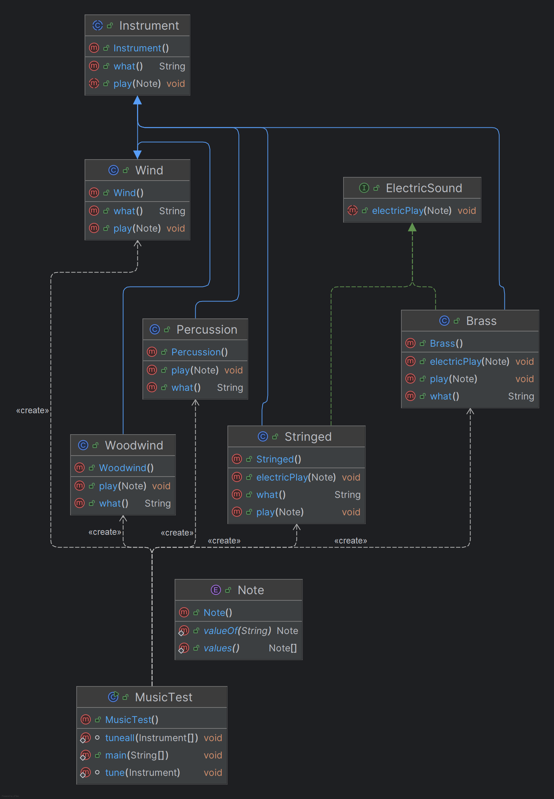

# Tema 01 | Clases Abstractas e Interfaces - Exercise06_Instrument

<h1 align="center">
  
</h1>

<div align="center">
  <strong>🎓 Parte del curso de Ingeniería del Software en U-tad</strong><br>
  🎹 Implementación de conceptos de clases abstractas e interfaces en una jerarquía de instrumentos musicales.
</div>

---

## 📄 Enunciado del Ejercicio: Clases Abstractas e Interfaces

El objetivo de este ejercicio es implementar y analizar diferentes clases que ejemplifiquen los conceptos de clases abstractas e interfaces en la programación orientada a objetos. A continuación, se detallan las tareas realizadas:

### 1. Implementación de Clases Especializadas
- Implementar las clases `Percussion`, `Stringed`, `Woodwind` y `Brass` según el diseño proporcionado.
- Cada clase debe implementar correctamente los métodos abstractos de la clase base `Instrument`.

### 2. Creación de Objetos y Método `main`
- Añadir la creación de cada objeto en el método `main` de la clase `MusicTest`.
- Implementar correctamente el método `tuneAll` para afinar todos los instrumentos.

### 3. Implementación de Interfaces
- Modificar las clases `Stringed` y `Brass` para que implementen la interfaz `ElectricSound`.
- Añadir la implementación del método `electricPlay` para ambas clases.

### 4. Modificación de Métodos
- Modificar el método `tune` de la clase `MusicTest` para que, además de invocar el método `play` con la nota DO, también invoque el método `electricPlay` con la nota MI para los instrumentos que implementen la interfaz `ElectricSound`.

---

## 📂 Estructura de la Carpeta

> [!TIP]
> **Organización del Proyecto:**  
> Mantener una estructura clara facilita el mantenimiento y la extensibilidad del código. Revisa la siguiente organización para entender la distribución de los archivos.

### 📁 Estructura de la carpeta `Exercise06_Instrument`:
```
📁 Exercise06_Instrument
├── 📄 Note.java                // Enumeración para representar las notas musicales
├── 📄 Instrument.java          // Clase abstracta base para todos los instrumentos
├── 📄 ElectricSound.java       // Interfaz para comportamiento electrónico
├── 📄 Wind.java                // Subclase para instrumentos de viento
├── 📄 Woodwind.java            // Subclase de Wind para instrumentos de viento-madera
├── 📄 Brass.java               // Subclase de Wind para instrumentos de viento-metal
├── 📄 Percussion.java          // Subclase para instrumentos de percusión
├── 📄 Stringed.java            // Subclase para instrumentos de cuerda
├── 📄 MusicTest.java           // Clase principal con método main para probar el sistema
├── 📄 UML.png                  // Diagrama UML que muestra la jerarquía de clases
└── 📄 README.md                // Documento explicativo del ejercicio y solución
```

---

## 🌟 Diagrama UML de la Solución



*Diagrama UML representando la jerarquía de clases e interfaces del sistema.*

---

## 📜 Descripción de la Solución

La solución implementa un sistema de instrumentos musicales utilizando clases abstractas e interfaces. A continuación, se detalla cada componente:

### 1. **Enumeración `Note`**

```java
public enum Note {
    DO, RE, MI;
}
```

**Explicación:**
- Representa las notas musicales básicas que pueden ser tocadas por los instrumentos.
- Utiliza una enumeración como un tipo de datos seguro para representar un conjunto fijo de constantes.

### 2. **Clase Abstracta `Instrument`**

```java
public abstract class Instrument {
    // Método abstracto que será implementado por las subclases
    public abstract void play(Note note);

    // Método común para describir el instrumento
    public String what() {
        return "Instrument";
    }
}
```

**Explicación:**
- Define la estructura básica de todos los instrumentos.
- Declara un método abstracto `play` que debe ser implementado por cada subclase.
- Proporciona una implementación por defecto para el método `what()` que puede ser sobrescrito.

### 3. **Interfaz `ElectricSound`**

```java
public interface ElectricSound {
    void electricPlay(Note note);
}
```

**Explicación:**
- Define un contrato para instrumentos que pueden producir sonidos electrónicos.
- Declara un método `electricPlay` que debe ser implementado por las clases que adopten esta interfaz.

### 4. **Clase `Wind`**

```java
public class Wind extends Instrument {
    @Override
    public void play(Note note) {
        System.out.println("Wind.play() " + note);
    }

    @Override
    public String what() {
        return "Wind";
    }
}
```

**Explicación:**
- Implementa la clase abstracta `Instrument`.
- Proporciona una implementación concreta del método `play`.
- Sobrescribe el método `what()` para devolver "Wind" en lugar de "Instrument".

### 5. **Clase `Woodwind`**

```java
public class Woodwind extends Wind {
    @Override
    public void play(Note note) {
        System.out.println("Woodwind.play() " + note);
    }

    @Override
    public String what() {
        return "Woodwind";
    }
}
```

**Explicación:**
- Extiende la clase `Wind`, creando una jerarquía más específica.
- Sobrescribe el método `play` para proporcionar una implementación específica para instrumentos de viento-madera.
- Sobrescribe el método `what()` para devolver "Woodwind".

### 6. **Clase `Brass` con Interfaz**

```java
public class Brass extends Wind implements ElectricSound {
    @Override
    public void play(Note note) {
        System.out.println("Brass.play() " + note);
    }

    @Override
    public void electricPlay(Note note) {
        System.out.println("ElectricSound.Brass.play() " + note);
    }

    @Override
    public String what() {
        return "Brass";
    }
}
```

**Explicación:**
- Extiende la clase `Wind` y además implementa la interfaz `ElectricSound`.
- Proporciona implementaciones para ambos métodos: `play` y `electricPlay`.
- Demuestra cómo una clase puede heredar de una clase base y también implementar una interfaz.

### 7. **Clase `Percussion`**

```java
public class Percussion extends Instrument {
    @Override
    public void play(Note note) {
        System.out.println("Percussion.play() " + note);
    }

    @Override
    public String what() {
        return "Percussion";
    }
}
```

**Explicación:**
- Implementa la clase abstracta `Instrument`.
- Proporciona una implementación concreta para el método `play` adaptada a instrumentos de percusión.
- Sobrescribe el método `what()` para devolver "Percussion".

### 8. **Clase `Stringed` con Interfaz**

```java
public class Stringed extends Instrument implements ElectricSound {
    @Override
    public void play(Note note) {
        System.out.println("Stringed.play() " + note);
    }

    @Override
    public void electricPlay(Note note) {
        System.out.println("ElectricSound.Stringed.play() " + note);
    }

    @Override
    public String what() {
        return "Stringed";
    }
}
```

**Explicación:**
- Implementa la clase abstracta `Instrument` y la interfaz `ElectricSound`.
- Proporciona implementaciones para ambos métodos: `play` y `electricPlay`.
- Demuestra cómo los instrumentos de cuerda pueden tener tanto comportamiento acústico como electrónico.

### 9. **Clase `MusicTest`**

```java
public class MusicTest {
    // Método para afinar un instrumento
    static void tune(Instrument instrument) {
        instrument.play(Note.DO);

        // Si el instrumento es eléctrico, reproducir sonido electrónico
        if (instrument instanceof ElectricSound) {
            ElectricSound electric = (ElectricSound) instrument;
            electric.electricPlay(Note.MI);
        }
    }

    // Método para afinar todos los instrumentos
    static void tuneall(Instrument[] instruments) {
        for (Instrument i : instruments) {
            tune(i);
        }
    }

    public static void main(String[] args) {
        // Creación de la banda de instrumentos
        Instrument[] orchestra = {
                new Wind(),
                new Percussion(),
                new Stringed(),
                new Woodwind(),
                new Brass()
        };

        // Afinar todos los instrumentos
        tuneall(orchestra);
    }
}
```

**Explicación:**
- Contiene el método `main` que crea instancias de todos los instrumentos y los organiza en un array.
- Define un método `tune` que afina un solo instrumento.
- Implementa un método `tuneall` que recorre el array de instrumentos y afina cada uno.
- Utiliza el operador `instanceof` para detectar si un instrumento implementa la interfaz `ElectricSound`.
- Realiza una conversión de tipo (cast) para acceder al método `electricPlay` cuando es necesario.

---

## 🔍 Análisis de Clases Abstractas e Interfaces

### 1. **Clases Abstractas**

Las clases abstractas, como `Instrument` en este ejercicio, proporcionan:

- **Implementación parcial**: Pueden contener métodos con implementación (como `what()`) y métodos abstractos (como `play()`).
- **Herencia única**: Una clase solo puede heredar de una clase abstracta (herencia simple).
- **Estado y comportamiento**: Pueden tener atributos y métodos concretos.
- **Constructores**: Pueden tener constructores, aunque no se pueden instanciar directamente.

En este ejercicio, `Instrument` actúa como una base para todas las clases de instrumentos, estableciendo un contrato común (el método `play`) y proporcionando una implementación por defecto para `what()`.

### 2. **Interfaces**

Las interfaces, como `ElectricSound` en este ejercicio, proporcionan:

- **Contrato puro**: Definen un conjunto de métodos que deben ser implementados.
- **Herencia múltiple**: Una clase puede implementar múltiples interfaces.
- **Sin estado**: Tradicionalmente, las interfaces no pueden tener atributos con estado (aunque en versiones recientes de Java se permiten constantes y métodos por defecto).
- **Sin constructores**: Las interfaces no tienen constructores.

En este ejercicio, `ElectricSound` define un comportamiento adicional que puede ser adoptado por cualquier tipo de instrumento, independientemente de su posición en la jerarquía de clases.

### 3. **Polimorfismo**

El polimorfismo se manifiesta de varias formas en este ejercicio:

- **Polimorfismo de subtipo**: La variable `Instrument[] orchestra` puede contener instancias de cualquier subclase de `Instrument`.
- **Enlace dinámico**: Cuando se llama a `instrument.play(Note.DO)`, se ejecuta la implementación específica del tipo real del objeto.
- **Interfaz como tipo**: La verificación `instrument instanceof ElectricSound` permite tratar objetos de diferentes clases de manera uniforme si implementan la misma interfaz.

### 4. **Herencia vs. Composición**

Este ejercicio demuestra:

- **Herencia**: `Woodwind` y `Brass` extienden `Wind`, que a su vez extiende `Instrument`.
- **Interfaces como mecanismo de composición**: `Stringed` y `Brass` "componen" su comportamiento implementando `ElectricSound`.

Esto ilustra cómo la herencia es adecuada para expresar relaciones "es-un" (un Woodwind es un Wind), mientras que las interfaces son más adecuadas para expresar capacidades adicionales que pueden ser añadidas a diferentes tipos de objetos.

---

## 💻 Ejemplo de Ejecución

Al ejecutar el método `main` de la clase `MusicTest`, se produce la siguiente salida:

```
Wind.play() DO
Percussion.play() DO
Stringed.play() DO
ElectricSound.Stringed.play() MI
Woodwind.play() DO
Brass.play() DO
ElectricSound.Brass.play() MI
```

**Análisis de la ejecución:**
1. Los instrumentos `Wind`, `Percussion` y `Woodwind` solo ejecutan el método `play()`.
2. Los instrumentos `Stringed` y `Brass`, que implementan la interfaz `ElectricSound`, ejecutan tanto `play()` como `electricPlay()`.
3. Esto demuestra cómo el operador `instanceof` y la conversión de tipos permiten tratar de manera especial a los objetos que implementan una interfaz específica.

---

## 📚 Conclusiones

Este ejercicio demuestra varios conceptos fundamentales de la programación orientada a objetos:

1. **Abstracción**: El uso de clases abstractas para definir comportamientos comunes pero incompletos.
2. **Herencia**: La creación de jerarquías de clases para representar relaciones "es-un".
3. **Interfaces**: El uso de interfaces para definir capacidades adicionales que pueden ser adoptadas por diferentes tipos de objetos.
4. **Polimorfismo**: La capacidad de tratar objetos de diferentes clases de manera uniforme.

**Aplicaciones prácticas:**
- En sistemas de música digital, este diseño permitiría tratar diferentes tipos de instrumentos de manera uniforme, mientras que algunos podrían tener capacidades adicionales (como conectarse a una interfaz MIDI).
- En frameworks de desarrollo, las clases abstractas y las interfaces permiten crear sistemas extensibles y flexibles.
- En la programación de videojuegos, este enfoque permitiría que diferentes tipos de objetos compartan comportamientos comunes, pero también tengan características únicas.

Las clases abstractas e interfaces son herramientas poderosas para crear diseños flexibles y extensibles, permitiendo la reutilización de código y la interoperabilidad entre diferentes componentes de un sistema.

---

## 📬 Contacto

<p align="center"> Si tienes preguntas o deseas colaborar en proyectos similares, ¡no dudes en contactarme! </p>

<p align="center">
  <a href="https://www.linkedin.com/in/manuel-mart%C3%ADnez-ram%C3%B3n-415711265/"></a>
  <a href="mailto:manu08martinez@gmail.com"></a>
</p>