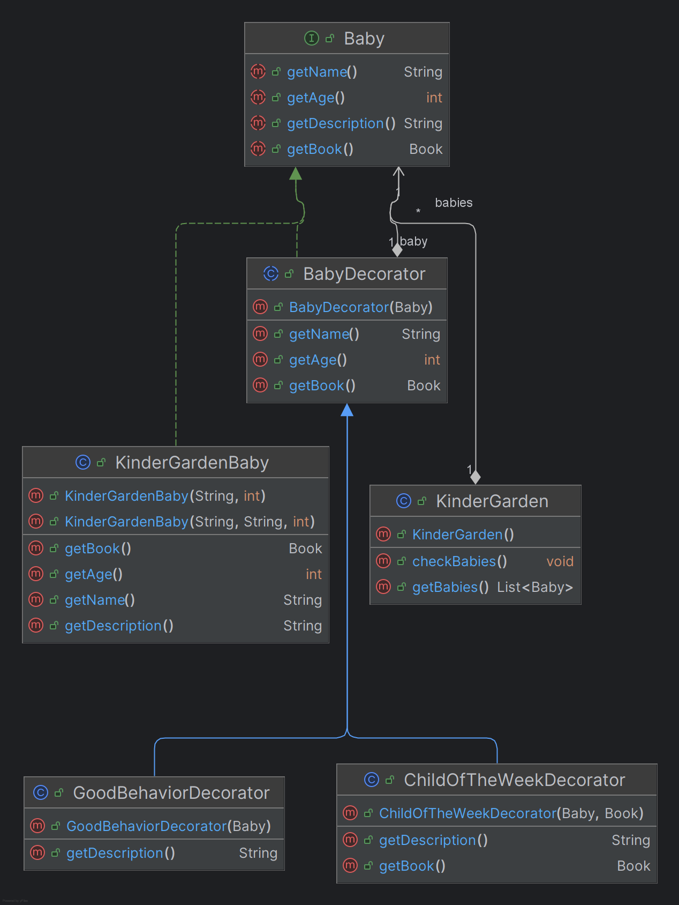

# Patrón Decorator (Tema 02) - Kindergarten

<h1 align="center">
  
</h1>

<div align="center">
  <strong>🎓 Parte del curso de Ingeniería del Software en U-tad</strong><br>
  🚀 Implementación del Patrón Decorator para modelar recompensas en una guardería.
</div>

---

## 📄 Enunciado del Ejercicio

<p align="center">
  <a href="https://github.com/ch0rtas/IS-Diseno_de_Software/blob/main/DisenoSoftware/src/Tema02/PatronDecorator/kindergarten/Ejercicio_PatronDecorator.png">
    
  </a>
</p>

El ejercicio consiste en implementar una solución basada en el **Patrón Decorator** para modelar una guardería en la que se asignan recompensas dinámicamente a los niños según su comportamiento semanal.  
Las recompensas son:

- **Pegatina base:** Se entrega a todos los niños.
- **Certificado de buena conducta:** Para aquellos que usan el baño en lugar del pañal.
- **Premio de la semana (libro):** Para el "niño de la semana", que recibe además un libro.

La solución permite añadir o retirar recompensas sin modificar la estructura del objeto base, gracias a la aplicación de decoradores.

---

## 📂 Estructura de la Carpeta

> [!TIP]
> **Organización del Proyecto:**  
> Mantener una estructura clara facilita el mantenimiento y la extensibilidad del código. Revisa la siguiente organización para entender la distribución de los archivos.

### 📁 Estructura de la carpeta `kindergarten`:
```
📁 PatronDecorator/kindergarten 
├── 📄 Baby.java 
├── 📄 BabyDecorator.java 
├── 📄 ChildOfTheWeekDecorator.java 
├── 📄 GoodBehaviorDecorator.java 
├── 📄 KinderGarden.java 
├── 📄 KinderGardenBaby.java 
├── 📄 KinderGardenDecoratorTest.java 
├── 📄 UML.drawio 
├── 🖼️ UML.drawio.png 
└── 🖼️ UML.png
```

---

## 🌟 Diagrama UML de la Solución

<p align="center">
  <a href="UML.png">
    
  </a>
</p>
<p align="center"><i>Figura 1: Diagrama UML generado para el Patrón Decorator en la guardería.</i></p>

<p align="center">
  <a href="UML.drawio">
    
  </a>
</p>
<p align="center"><i>Figura 2: Diagrama UML en formato Draw.io.</i></p>

> [!IMPORTANT]
> **Clave del Diagrama:**  
> El diagrama ilustra cómo se extiende la funcionalidad del objeto `Baby` mediante decoradores que añaden recompensas de forma dinámica, sin modificar el objeto base `KinderGardenBaby`.

---

## 🛠️ Descripción de la Solución

La solución se estructura en tres componentes principales:

### 1. **Interfaz: `Baby`**

Define la estructura básica que debe cumplir cualquier objeto que represente a un niño en la guardería.

_Archivo: `Baby.java`_
```java
public interface Baby {
    String getName();
    int getAge();
    String getDescription();

    /**
     * Devuelve el libro asignado si el niño es "niño de la semana", o null en caso contrario.
     */
    Book getBook();
}
```

> [!NOTE]
> **Propósito:**  
> La interfaz Baby permite que tanto el componente base como los decoradores tengan una estructura común y sean intercambiables.

### 2. **Componente Base y Decoradores**

#### **Componente Base: `KinderGardenBaby`**

Representa a un niño sin ninguna recompensa adicional. Es el objeto "sin decorar".

_Archivo: `KinderGardenBaby.java`_
```java
public class KinderGardenBaby implements Baby {
    private String name;
    private int age;
    private String nickname;

    // Constructor mínimo
    public KinderGardenBaby(String name, int age) {
        this(name, name, age);
    }

    // Constructor con nombre y apodo
    public KinderGardenBaby(String name, String nickname, int age) {
        this.name = name;
        this.nickname = nickname;
        this.age = age;
    }

    @Override
    public String getName() {
        return (nickname != null) ? nickname : name;
    }

    @Override
    public int getAge() {
        return age;
    }

    @Override
    public String getDescription() {
        return getName();
    }

    @Override
    public Book getBook() {
        return null;
    }
}
```

#### **Decorador Abstracto: `BabyDecorator`**

Sirve como base para los decoradores concretos, permitiendo extender la funcionalidad del objeto Baby sin modificarlo directamente.

_Archivo: `BabyDecorator.java`_
```java
public abstract class BabyDecorator implements Baby {
    protected Baby baby;  // Referencia al objeto decorado

    public BabyDecorator(Baby baby) {
        this.baby = baby;
    }

    @Override
    public String getName() {
        return baby.getName();
    }

    @Override
    public int getAge() {
        return baby.getAge();
    }

    @Override
    public Book getBook() {
        return baby.getBook();
    }
}
```

### 3. **Decoradores Concretos**

#### **`GoodBehaviorDecorator`**

Añade la recompensa de buena conducta, modificando la descripción del niño.

_Archivo: `GoodBehaviorDecorator.java`_
```java
public class GoodBehaviorDecorator extends BabyDecorator {

    public GoodBehaviorDecorator(Baby baby) {
        super(baby);
    }

    @Override
    public String getDescription() {
        return baby.getDescription() + " con premio de buena conducta pañal";
    }
}
```

#### **`ChildOfTheWeekDecorator`**

Añade la recompensa de "niño de la semana" junto con la asignación de un libro.

_Archivo: `ChildOfTheWeekDecorator.java`_
```java
public class ChildOfTheWeekDecorator extends BabyDecorator {

    private Book book; // Libro asignado al niño de la semana

    public ChildOfTheWeekDecorator(Baby baby, Book book) {
        super(baby);
        this.book = book;
    }

    @Override
    public String getDescription() {
        return baby.getDescription() + "; es niño/a de la semana con libro: " + book.toString();
    }

    @Override
    public Book getBook() {
        return this.book;
    }
}
```

### 4. **Clase de Gestión: `KinderGarden`**

Administra la lista de niños y proporciona el método para "pasar lista", mostrando la descripción actualizada de cada niño según sus recompensas.

_Archivo: `KinderGarden.java`_
```java
public class KinderGarden {
    private List<Baby> babies;

    public KinderGarden() {
        this.babies = new ArrayList<>();
    }

    public List<Baby> getBabies() {
        return babies;
    }

    public void checkBabies() {
        System.out.println("====Pasamos lista====");
        for (Baby baby : babies) {
            System.out.println(baby.getDescription());
        }
    }
}
```

### 5. **Clase de Prueba: `KinderGardenDecoratorTest`**

Demuestra la aplicación dinámica de los decoradores:
- Se muestran los nombres básicos de los niños.
- Se añade el decorador `GoodBehaviorDecorator` a Inés para otorgarle el certificado de buena conducta.
- Se añade el decorador `ChildOfTheWeekDecorator` a Inés para asignarle el libro del premio de la semana.
- Finalmente, se verifica y muestra el libro asignado a Inés.

_Archivo: `KinderGardenDecoratorTest.java`_
```java
public class KinderGardenDecoratorTest {

    public static void main(String[] args) {
        // Creamos la guardería y el libro de ejemplo
        KinderGarden kinderGarden = new KinderGarden();
        Book book = new Book("Desing patterns", "Gang of four", BookState.GOOD);

        // Creamos dos bebés: Kike e Inés
        KinderGardenBaby ines = new KinderGardenBaby("Inés", 1);
        KinderGardenBaby kike = new KinderGardenBaby("Enrioque", "Kike", 2);

        // Añadimos los bebés a la guardería
        kinderGarden.getBabies().add(kike);
        kinderGarden.getBabies().add(ines);

        // 1) Primera pasada de lista
        kinderGarden.checkBabies(); // Salida: "Kike" y "Inés"

        // Inés recibe el certificado de buena conducta
        Baby decoratedInes = new GoodBehaviorDecorator(ines);
        kinderGarden.getBabies().set(kinderGarden.getBabies().indexOf(ines), decoratedInes);

        // 2) Segunda pasada de lista
        kinderGarden.checkBabies();
        // Salida: "Kike" y "Inés con premio de buena conducta pañal"

        // Inés recibe el premio de la semana (libro)
        Baby childOfWeekInes = new ChildOfTheWeekDecorator(decoratedInes, book);
        kinderGarden.getBabies().set(
                kinderGarden.getBabies().indexOf(decoratedInes),
                childOfWeekInes
        );

        // 3) Tercera pasada de lista
        kinderGarden.checkBabies();
        // Salida: "Kike" y "Inés con premio de buena conducta pañal; es niño/a de la semana con libro: Book [title=Desing patterns, author=Gang of four, bookState=GOOD]"

        // Comprobamos si Inés tiene libro y mostramos el título
        if (childOfWeekInes.getBook() != null) {
            System.out.println(childOfWeekInes.getName() 
                    + " tiene el libro: " 
                    + childOfWeekInes.getBook().getTitle());
        }
    }
}
```

---

## 📜 Ejecución de la Solución

Al ejecutar la clase `KinderGardenDecoratorTest`, se espera obtener una salida similar a la siguiente:

```
====Pasamos lista====
Kike
Inés
====Pasamos lista====
Kike
Inés con premio de buena conducta pañal
====Pasamos lista====
Kike
Inés con premio de buena conducta pañal; es niño/a de la semana con libro: Book [title=Desing patterns, author=Gang of four, bookState=GOOD]
Inés tiene el libro: Desing patterns
```

> [!NOTE]
> **Recomendación para Pruebas:**  
> Ejecuta la clase `KinderGardenDecoratorTest` para observar la dinámica de aplicación de decoradores y cómo se combinan las recompensas en tiempo de ejecución.

---

## 💡 Ventajas de la Solución

**Beneficios Clave (Patrón Decorator):**
- **Extensibilidad:** Permite agregar nuevas recompensas sin modificar la clase base.
- **Flexibilidad:** Las recompensas se pueden añadir y quitar dinámicamente en tiempo real.
- **Mantenimiento:** Cada decorador encapsula una responsabilidad específica, facilitando la extensión y modificación del sistema.
- **Extensibilidad:** Al implementar nuevos decoradores, se pueden introducir funcionalidades adicionales sin alterar el objeto base.
- **Flexibilidad:** Se pueden combinar distintas recompensas de forma dinámica según las necesidades.
- **Mantenimiento:** La separación de responsabilidades en decoradores específicos simplifica futuras modificaciones.

---

## 📬 Contacto

<p align="center"> Si tienes preguntas o deseas colaborar en proyectos similares, ¡no dudes en contactarme! </p>

<p align="center">
  <a href="https://www.linkedin.com/in/manuel-mart%C3%ADnez-ram%C3%B3n-415711265/">
    
  </a>
  <a href="mailto:manu08martinez@gmail.com">
    
  </a>
</p>
