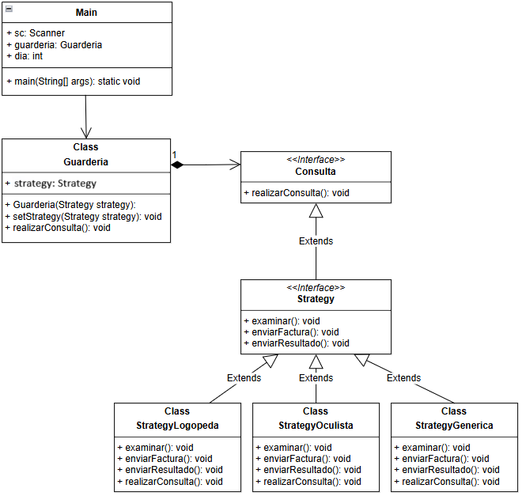

# 📌 Implementación del Patrón Strategy en una Guardería

## 📖 Introducción
Este proyecto implementa el **Patrón Strategy** para manejar diferentes tipos de consulta médica en una guardería. Dependiendo del día del mes, la guardería cambia su comportamiento eligiendo un tipo de consulta diferente:
- **Día 15** → Consulta con el Oculista.
- **Día 28** → Consulta con el Logopeda.
- **Cualquier otro día** → Consulta genérica con el médico de guardia.

Para lograr esto, utilizamos el Patrón Strategy, permitiendo a `Guarderia` cambiar su comportamiento dinámicamente sin modificar su código interno.

## 🖼️ UML del Proyecto


---

## 🎯 **Componentes del Patrón Strategy**
El Patrón Strategy se compone de **tres elementos principales**:

### 1️⃣ **Contexto (`Guarderia`)**
El contexto es el objeto cuyo comportamiento varía en función de la estrategia elegida. En este caso, `Guarderia` cambia su estrategia dependiendo del día del mes.

```java
public class Guarderia {
    private Strategy strategy; // 🔹 Esta es una referencia a un objeto de tipo Strategy.

    public Guarderia(Strategy strategy) {
        this.strategy = strategy;
    }

    public void setStrategy(Strategy strategy) {
        this.strategy = strategy;
    }

    public void realizarConsulta() {
        strategy.realizarConsulta();
    }
}
```

### 📌 **Explicación sobre las Referencias en Java**

#### 🔹 **¿Qué es una referencia en este contexto?**
Una referencia es un puntero a un objeto en memoria, pero **por sí sola no es un objeto**. En este caso, `private Strategy strategy;` es una referencia que puede apuntar a cualquier objeto que implemente `Strategy`.

#### 🔹 **¿Por qué usamos una referencia en lugar de un objeto concreto?**
Usamos una referencia porque:
- Nos permite cambiar dinámicamente la estrategia sin necesidad de modificar `Guarderia`.
- Habilita el **polimorfismo**, permitiendo que `strategy` pueda ser reemplazado por cualquier implementación concreta (`StrategyOculista`, `StrategyLogopeda`, etc.).
- Separa la lógica de `Guarderia` de la implementación específica de las estrategias.

#### 🔹 **¿Cómo se usa en el código?**
- `Guarderia` mantiene una referencia a un objeto de tipo `Strategy`, que define los métodos `examinar()`, `enviarFactura()` y `enviarResultado()`.
- `realizarConsulta()` (de la clase `Guarderia`) llama al método `realizarConsulta()` de la estrategia correspondiente, sin conocer cuál es su implementación específica.
- La **implementación real** de los métodos (`examinar()`, `enviarFactura()`, `enviarResultado()`) recae exclusivamente sobre cada estrategia concreta (`StrategyOculista`, `StrategyLogopeda`, `StrategyGenerica`).

---

### 2️⃣ **Interfaz `Strategy` (Definición de la Estrategia)**
Define los métodos que todas las estrategias deben implementar. Se debe de entender como un contrato que las estrategias deben de cumplir.

```java
public interface Strategy extends Consulta {
    void examinar();
    void enviarFactura();
    void enviarResultado();
}
```
**Explicación:**
- `Strategy` extiende `Consulta`, asegurando que todas las estrategias implementen `realizarConsulta()`.
- Declara `examinar()`, `enviarFactura()` y `enviarResultado()`, que serán implementados por cada estrategia concreta.

---

### 3️⃣ **Interfaz `Consulta` y su Propósito**

Aunque `Consulta` no es parte estrictamente del **Patrón Strategy**, se introduce para mejorar la abstracción en el código.

```java
public interface Consulta {
    void realizarConsulta();
}
```

**¿Para qué sirve?**
- **Aumenta la abstracción**: `Guarderia` solo interactúa con `Strategy` a través del método `realizarConsulta()`, sin preocuparse por los detalles de `examinar()`, `enviarFactura()` ni `enviarResultado()`.
- **Facilita el mantenimiento**: Al extender `Strategy` de `Consulta`, todas las estrategias concretas **deben** implementar `realizarConsulta()`, lo que estandariza la forma en que se ejecutan las consultas.
- **Mejora la encapsulación**: `Guarderia` solo necesita llamar `realizarConsulta()`, dejando que las estrategias manejen sus propias acciones internas.

---

### 4️⃣ **Clases Concretas (Implementaciones de `Strategy`)**
Cada estrategia representa un tipo diferente de consulta.


#### **🟢 `StrategyOculista` (Día 15)**
```java
public class StrategyOculista implements Strategy {
    @Override
    public void examinar() {
        System.out.println("Examinando a día 15 con el doctor Wang, graduando la vista de los niños");
    }
    @Override
    public void enviarFactura() {
        System.out.println("Enviando factura a día 15 con el doctor Wang");
    }
    @Override
    public void enviarResultado() {
        System.out.println("Enviando resultado a día 15 con el doctor Wang");
    }
    @Override
    public void realizarConsulta() {
        this.examinar();
        this.enviarFactura();
        this.enviarResultado();
    }
}
```

#### **🟡 `StrategyLogopeda` (Día 28)**
```java
public class StrategyLogopeda implements Strategy {
    @Override
    public void examinar() {
        System.out.println("Examinando a día 28 con el doctor Fang, evaluando la dicción de los niños");
    }
    @Override
    public void enviarFactura() {
        System.out.println("Enviando factura a día 28 con el doctor Fang");
    }
    @Override
    public void enviarResultado() {
        System.out.println("Enviando resultado a día 28 con el doctor Fang");
    }
    @Override
    public void realizarConsulta() {
        this.examinar();
        this.enviarFactura();
        this.enviarResultado();
    }
}
```

#### **🔵 `StrategyGenerica` (Cualquier otro día)**
```java
public class StrategyGenerica implements Strategy {
    @Override
    public void examinar() {
        System.out.println("Examinando a día <sin especificar> con el doctor correspondiente");
    }
    @Override
    public void enviarFactura() {
        System.out.println("Enviando factura a día <sin especificar> con el doctor correspondiente");
    }
    @Override
    public void enviarResultado() {
        System.out.println("Enviando resultado a día <sin especificar> con el doctor correspondiente");
    }
    @Override
    public void realizarConsulta() {
        this.examinar();
        this.enviarFactura();
        this.enviarResultado();
    }
}
```

---

## 🚀 **Conclusión**
✅ `Guarderia` puede cambiar de estrategia dinámicamente sin modificar su código.
✅ `Strategy` define una interfaz clara que permite agregar nuevas estrategias fácilmente.
✅ `Consulta` aumenta la abstracción y mantiene a `Guarderia` desacoplada de `Strategy`.

Este diseño sigue el **Principio de Abierto/Cerrado (OCP)** y el **Principio de Responsabilidad Única (SRP)**, haciendo que el código sea modular y extensible. 🎯🚀
